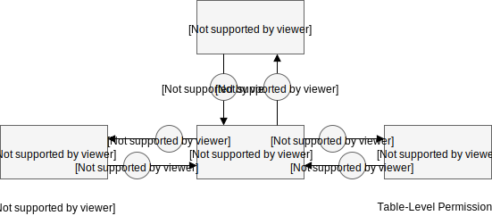

# Knowledgebase Database and API


The KB is implemented using [orientDB](https://github.com/orientechnologies/orientdb) and [orientjs](https://github.com/orientechnologies/orientjs).
It is a graph database which is used to store variants, ontologies, and the relevance of this terms and variants. The KB uses strict controlled vocbulary to provide a parseable and machine-readable interface for other applications to build on. The API is a REST API built on node/express.


### Table Of Contents

- [Getting Started](#getting-started)
- [Database Schema](#database-schema)
- [OpenAPI Specification](#openapi-specification)
- [Authentication](#authentication)
- [Guidelines for Contributors](#guidelines-for-contributors)
- [Release Notes](doc/HISTORY.md)


## Getting Started

To start the API server you must first have the database server running. Then starting is as simple as running

```
npm start
```


## Database Schema

The schema for the database consist of four major types of data: ontology terms, variants, literature/evidence, and statements.


## OpenAPI Specification

All KB API routes are documented with openapi specification. The specification is hosted with the api under `/api/<version>/spec`

## Authentication

Authentication in the KB uses tokens. KB API tokens can be generated using the token route defined in the API specification.
The first layer of authentication happens when KB uses [CATS](https://www.bcgsc.ca/wiki/display/lims/CATS+Documentation) to authenticate users against the LDAP. A request is sent
to CATS with the users credentials and a token is returned if the user exists and has access to KB.

The next step happens when KB looks up the username in the KB database. Each user in KB belongs to one or more UserGroups. Each of these UserGroups contains table-level permission schemas.



In summary, KB Client will send user credentials and recieve a token which will be used in the header of all subsequent requests.

## Guidelines for Contributors

1. In-code documentation should follow JSDocs format see http://usejsdoc.org
2. TDD. New tests should be added for any new functionality. Using mocha (https://mochajs.org/) for testing. As mocha has several
   test styles, please match the existing style in the current tests.
3. API must follow REST guidelines (for example see https://github.com/Microsoft/api-guidelines/blob/vNext/Guidelines.md)
4. JS code should be written with ES6 syntax (where possible) see https://github.com/lukehoban/es6features