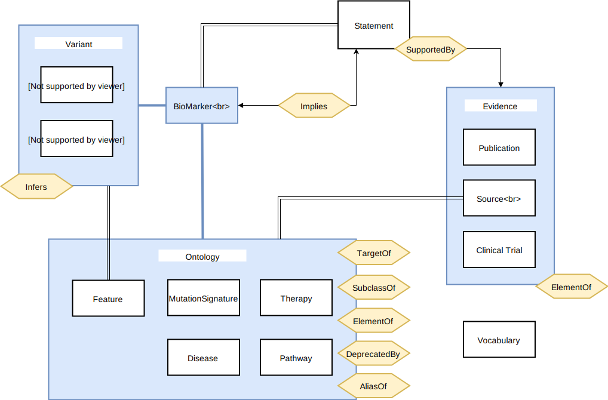

# Knowledgebase Database and API

A REST API implemented using the orientjs node framework.

orientjs: https://github.com/orientechnologies/orientjs

orientDB: https://github.com/orientechnologies/orientdb

---

## Dynamic Queries


GET requests on the API support regular query paramters as well as using special query operator syntax. These allow the user to
specify operators beyond `=` such as `!` (not), `~` (substring), and `|` (OR).
Note that all the urls shown below have not been escaped.

### Using the NOT Operator

Query all diseases where the name does not equal 'cancer'

```
/api/diseases?name=!cancer
```

### Using the Contains Operator

When applied to a string value this will look for a substring. If the attribute being
queried is a list, then it will check if the value is in the list.

Query all diseases where the name contains 'pancreatic'

```
/api/diseases?name=~pancreatic
```

### Combinining the Contains and NOT Operators

Query all diseases where the name does not contain 'breast'

```
/api/diseases?name=!~breast
```

### Using the OR operator

Query all diseases where the name is 'breast cancer' or 'breast carcinoma'

```
/api/diseases?name=breast cancer|breast carcinoma
```

### Combining the OR Operator with the NOT Operator

Query all diseases where the name is 'breast cancer' or is not 'pancreatic cancer'

```
/api/diseases?name=breast cancer|!pancreatic cancer
```

---


## Guidelines for Contributors

1. In-code documentation should follow JSDocs format see http://usejsdoc.org
2. TDD. New tests should be added for any new functionality. Using mocha (https://mochajs.org/) for testing. As mocha has several
   test styles, please match the existing style in the current tests.
3. API must follow REST guidelines (for example see https://github.com/Microsoft/api-guidelines/blob/vNext/Guidelines.md)
4. JS code should be written with ES6 syntax (where possible) see https://github.com/lukehoban/es6features



