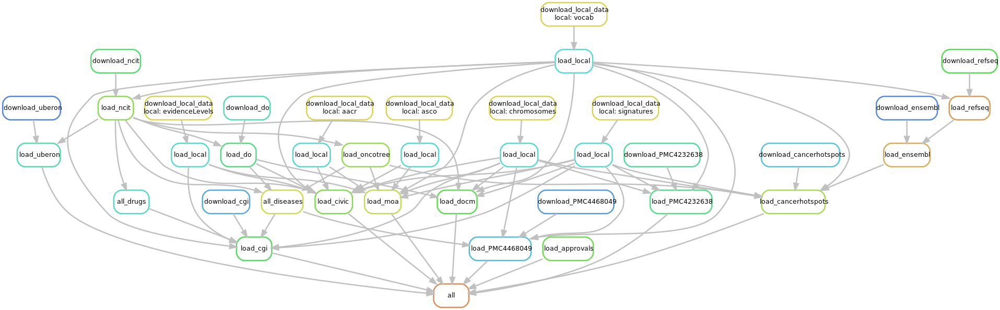

# GraphKB Loader

  

This repository is part of the [platform for oncogenomic reporting and interpretation](https://github.com/bcgsc/pori).

This package is used to import content from a variety of sources into GraphKB using the API.

- [Loaders](#loaders)
  - [Ontologies](#ontologies)
  - [Knowledge Bases](#knowledge-bases)
- [Guidelines for Developers](#guidelines-for-developers)
  - [Getting Started](#getting-started)
  - [Creating a new Loader](#creating-a-new-loader)
    - [API Loaders](#api-loaders)
    - [File Loaders](#file-loaders)
- [Initializing GraphKB Content](#initializing-graphkb-content)

Automatic Import modules are provided for a variety of input sources. To Start importing external data, first the GraphKB API
must already be running. Then the command line interface can be used for upload. Get the help menu
detailing the commands and required inputs as follows

```bash
node bin/load.js -- --help
```

or using docker

```bash
docker run bcgsc/pori-graphkb-loader --help
```

## Loaders

### Ontologies

- [ChEMBL](./src/chembl)
- [Disease Ontology](./src/diseaseOntology)
- [DrugBank](./src/drugbank)
- [Ensembl](./src/ensembl)
- [Entrez Utilities](./src/entrez)
- [FDA SRS](./src/fdaSrs)
- [FDA Approval Announcements](./src/fdaApprovals)
- [HGNC](./src/hgnc)
- [NCIt](./src/ncit)
- [OncoTree](./src/oncotree)
- [GraphKB Ontology JSON](./src/ontology)
- [RefSeq](./src/refseq)
- [Uberon](./src/uberon)

### Knowledge Bases

- [Cancer Genome Interpreter](./src/cancergenomeinterpreter)
- [Cancer Hotspots](./src/cancerhotspots)
- [CGL](./src/cgl)
- [CIViC](./src/civic)
- [ClinicalTrials.gov](./src/clinicaltrialsgov)
- [COSMIC](./src/cosmic)
- [DGIdb](./src/dgidb)
- [DoCM](./src/docm)
- [OncoKB](./src/oncokb)
- [PMC4468049](./src/PMC4468049)
- [PMC4232638](./src/PMC4232638)

## Guidelines for Developers

### Getting Started

Clone the repository

```bash
git clone https://github.com/bcgsc/pori_graphkb_loader.git
cd pori_graphkb_loader
git checkout develop
```

Install the dependencies

```bash
npm install
```

run the tests

```bash
npm run test
```

### Creating a new Loader

Loaders should be created with a directory directly under src name after the source of the content
being loaded. The directory should contain a README.md describing the loader and content and how
to obtain the data used by the loader.

There are 2 main patterns used by the loaders

#### API Loaders

These loaders do not require a file input and directly access an API (ex. [CIViC](./src/civic)).
Their main module will export a function called `upload` which has the following signature

```js
/**
 * @param {object} opt options
 * @param {ApiConnection} opt.conn the api connection object
 */
const upload = async ({conn}) => {
```

`conn` above will be an `ApiConnection` instance that has already been authenticated against the
GraphKB API instance.

#### File Loaders

Other loaders which use a file to load content follow a similar pattern except the function they
export is called `uploadFile` and accepts an additional argument. For example see the [disease ontology](./src/diseaseOntology) loader.

```js
/**
 * @param {object} opt options
 * @param {string} opt.filename the path to the input JSON file
 * @param {ApiConnection} opt.conn the api connection object
 */
const uploadFile = async ({ filename, conn }) => {
```

## Initializing GraphKB Content

For convenience, a snakemake workflow is included to run all available loaders in an optimal order
to initialize the content in a new instance of GraphKB. This is done via python snakemake. To set
up snakemake in a virtual environment run the following

```bash
python3 -m venv venv
source venv/bin/activate
pip install -U pip setuptools
pip install snakemake
```

Then the workflow can be run as follows (single core by default but can be adjusted depending on
your server settings)

```bash
snakemake -j 1
```



The COSMIC and DrugBank options require licensing and are therefore not run by default. If you have
a license to use them then you can include one or both of them by providing email and password
as config parameters

```bash
snakemake -j 1 \
  --config drugbank_email="YOUR EMAIL" \
  drugbank_password="YOUR PASSWORD" \
  cosmic_email="YOUR EMAIL" \
  cosmic_password="YOUR PASSWORD"
```


